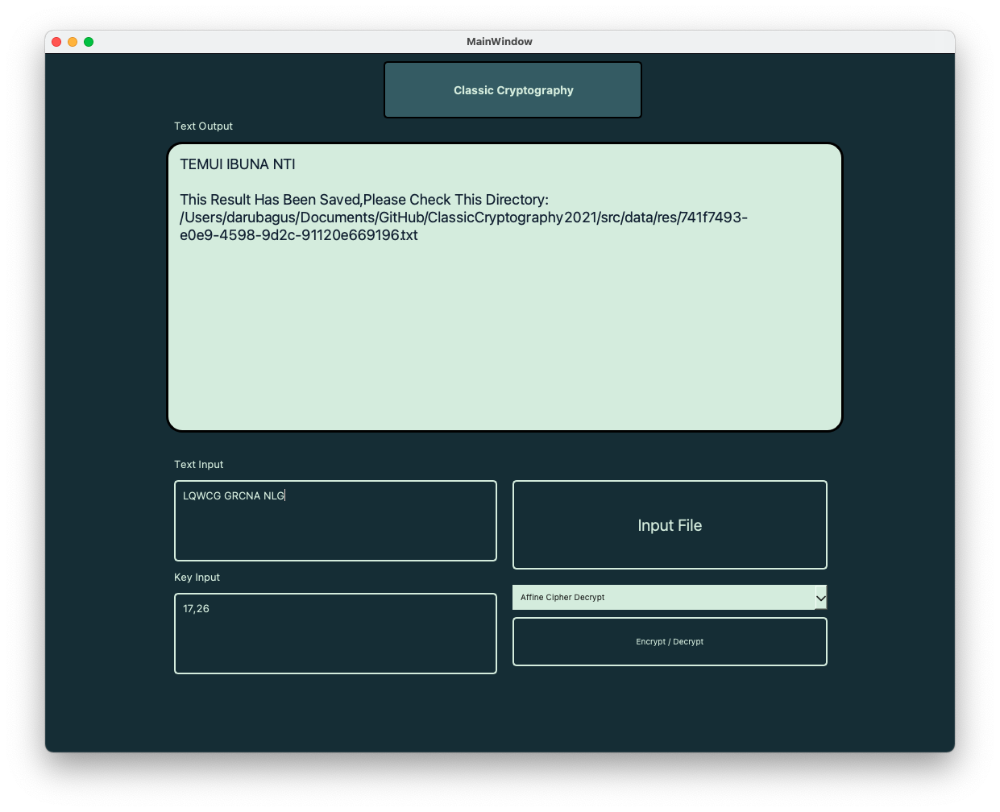
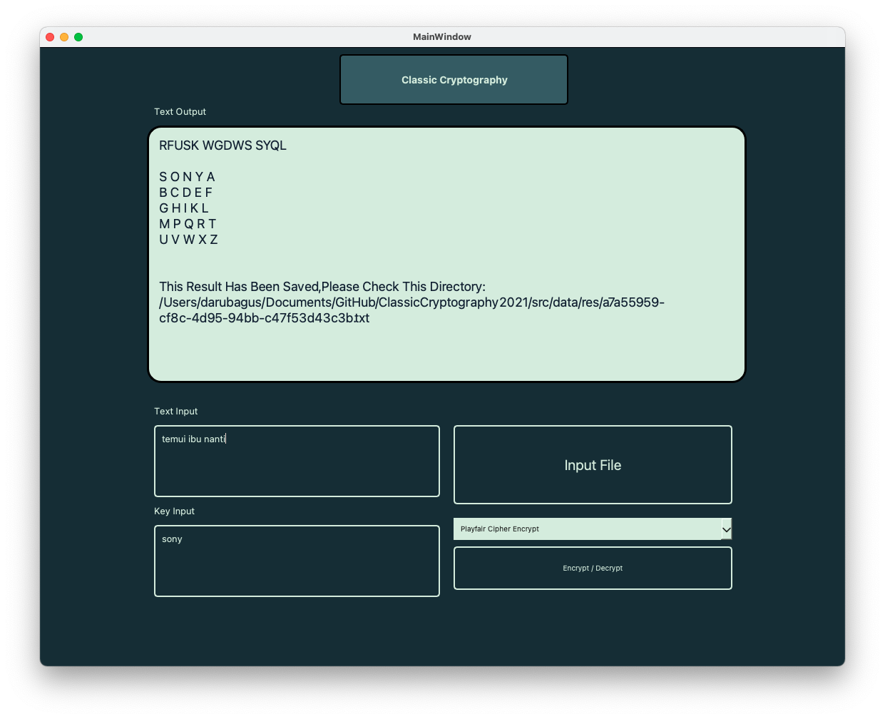

# Classic Cryptography
## General info
Program ini dibuat untuk memenuhi tugas Mata Kuliah **IF 4020 Kriptografi** <br />

Program Studi Teknik Informatika <br />
Sekolah Teknik Elektro dan Informatika <br />
Institut Teknologi Bandung <br />

Semester I Tahun 2021/2022

## Algorithm
* Standard Vigenere Cipher
* Full Vigenere Cipher
* Auto-key Vigenere Cipher
* Extended Vigenere Cipher
* Playfair Cipher
* Hill Cipher

## Screenshots





## Technologies
* Python - version 3.8.3
* PyQt - version 5
* Numpy - version 1.16.2

## Setup
```
  $pip3 install PyQt5
  $pip3 install numpy
```
## Executing The Program
```
  $python3 src/classic-crypto.py
```
## Features
* Encrypt-Decrypt text with various classic cryptography algorithm
* Encrypt-Decrypt any file using Extended Vigenere Cipher
## Author
* Daru Bagus Dananjaya (13519080)
* Karel Renaldi (13519180)
